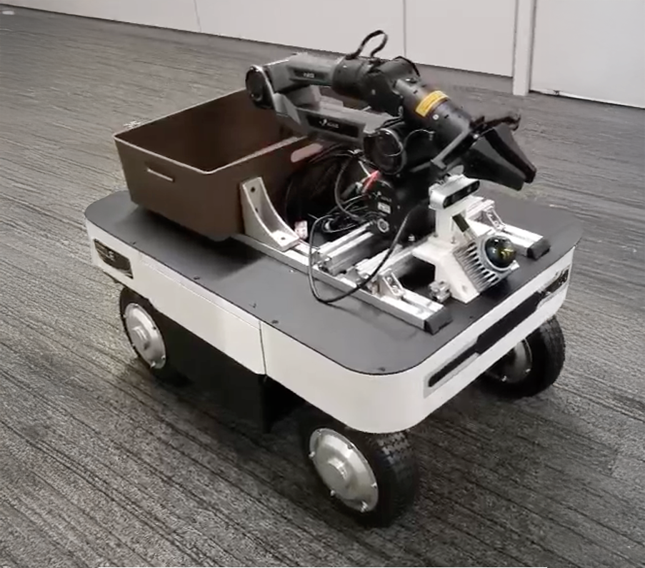

# Ranger Garden Assistant



A complete ROS 2 Humble stack for the AgileX Ranger Mini 3.0 omnidirectional mobile robot integrated with:
- **Livox Mid-360 LiDAR** for 360° 3D perception
- **Intel RealSense D435 Camera** for RGB-D vision
- **AgileX PiPER 6-DOF Arm** for manipulation
- **Navigation2** for autonomous navigation
- **MoveIt 2** for motion planning
- **FASTLIO2_ROS2** for tightly-coupled LiDAR-inertial odometry, pose graph optimization, and relocalization
- **Octomap_server2** for incremental 3D octomap building plus projected 2D costmaps

This workspace provides a fully integrated mobile manipulation platform suitable for garden assistance, warehouse automation, or research applications. The FASTLIO2_ROS2 stack now drives real-time odometry, loop-closure pose graph optimization (`map -> odom`), optional relocalization on saved maps, and feeds both Navigation2 and OctoMap_server2 for consistent global planning.

## Table of Contents
- [Hardware Requirements](#hardware-requirements)
- [Software Requirements](#software-requirements)
- [Installation](#installation)
- [Quick Start](#quick-start)
- [Usage](#usage)
- [Package Structure](#package-structure)
- [Configuration](#configuration)
- [Troubleshooting](#troubleshooting)
- [Contributing](#contributing)
- [License](#license)

## Hardware Requirements

### Required Hardware
- **AgileX Ranger Mini 3.0** - Omnidirectional mobile base
- **Livox Mid-360** - 3D LiDAR sensor
- **Intel RealSense D435** - RGB-D camera
- **AgileX PiPER Arm** - 6-DOF robotic arm (optional)
- **2x USB-CAN Adapters** - For base and arm control
- **Computing Platform** - Ubuntu 22.04 capable PC/NUC/Jetson

### Recommended Specifications
- CPU: Intel Core i5 or better (i7 recommended)
- RAM: 8GB minimum (16GB recommended)
- Storage: 50GB free space
- USB 3.0 ports for camera and sensors
- Network: Ethernet or WiFi for sensor communication

## Software Requirements

- **OS**: Ubuntu 22.04 LTS
- **ROS**: ROS 2 Humble Hawksbill
- **Python**: 3.10+
- **Additional packages** (installed via rosdep):
  - Navigation2
  - MoveIt 2
  - slam_toolbox
  - RealSense SDK 2.0
  - OctoMap (octomap_server2 + octomap_msgs + pcl_msgs + perception_pcl)
  - python-can
  - piper_sdk

## Installation

### 1. Install ROS 2 Humble

### 2. Install Additional Dependencies

```bash
# Navigation and control
sudo apt install ros-humble-navigation2 ros-humble-nav2-bringup -y
sudo apt install ros-humble-slam-toolbox -y

# MoveIt 2
sudo apt install ros-humble-moveit ros-humble-moveit-resources -y

# Control packages
sudo apt install ros-humble-ros2-control ros-humble-ros2-controllers -y
sudo apt install ros-humble-controller-manager -y

# TF and robot state
sudo apt install ros-humble-joint-state-publisher-gui -y
sudo apt install ros-humble-xacro -y

# RealSense camera
sudo apt install ros-humble-realsense2-camera -y

# Python dependencies
pip3 install python-can piper_sdk scipy
```

### 3. Setup CAN Interface

Install can-utils for CAN communication:

```bash
sudo apt install can-utils -y
```

Add your user to the dialout group:

```bash
sudo usermod -a -G dialout $USER
# Log out and log back in for this to take effect
```

### 4. Clone and Build Workspace

```bash
# Clone the repository
git clone https://github.com/yourusername/ranger-garden-assistant.git
cd ranger-garden-assistant

# Initialize submodules
git submodule update --init --recursive

# Build the workspace
./scripts/build_workspace.sh

# Source the workspace
source install/setup.bash
```

Alternatively, build manually:

```bash
# Install dependencies
rosdep update
rosdep install --from-paths src --ignore-src -r -y

# Build
colcon build --symlink-install --cmake-args -DCMAKE_BUILD_TYPE=Release

# Source
source install/setup.bash
```

## Quick Start

### 1. Setup Hardware

**Connect CAN adapters:**
- Plug USB-CAN adapter for base into USB port (should appear as `can0`)
- Plug USB-CAN adapter for arm into USB port (should appear as `can1`)

**Connect sensors:**
- Connect Livox Mid-360 via Ethernet or USB
- Connect RealSense D435 to USB 3.0 port

### 2. Configure CAN Interfaces

```bash
sudo ./scripts/setup_can.sh
```

Or manually:

```bash
# For Ranger base (500 kbps)
sudo ip link set can0 down
sudo ip link set can0 type can bitrate 500000
sudo ip link set can0 up

# For PiPER arm (1000 kbps)
sudo ip link set can1 down
sudo ip link set can1 type can bitrate 1000000
sudo ip link set can1 up
```

### 3. Launch FAST-LIO2 Mapping Stack

Launch the integrated bringup for mapping (sensors + FASTLIO2 odometry + PGO + OctoMap, Nav2 off):

```bash
source install/setup.bash
ros2 launch robofi_bringup fastlio2_navigation.launch.py \
  launch_nav2:=false \
  launch_localizer:=false \
  launch_octomap:=true \
  rviz_config:=$(ros2 pkg prefix robofi_bringup)/share/robofi_bringup/rviz/fastlio2_mapping.rviz
```

This starts the robot description, Livox Mid-360 driver, FASTLIO2 LIO (`odom -> base`), pose-graph optimization (`map -> odom`), OctoMap_server2, and RViz with a mapping layout. Drive the robot around using your preferred teleoperation method or remote control while this stack is running. After exploring, save maps as described in [FAST-LIO2 Mapping and Loop-Closure](#2-fast-lio2-mapping-and-loop-closure). The legacy `ranger_complete_bringup.launch.py` is still available when you only need the robot description and raw sensors.

### 4. Visualize in RViz

`fastlio2_navigation.launch.py` already launches RViz with the curated mapping layout when `launch_rviz:=true` (default). To bring it up manually (for example, if you start RViz in its own terminal), load the same config shipped in `robofi_bringup`:

```bash
source install/setup.bash
rviz2 -d $(ros2 pkg prefix robofi_bringup)/share/robofi_bringup/rviz/fastlio2_mapping.rviz
```

This configuration already enables `/fastlio2/lio_path`, `/fastlio2/lio_odom`, `/pgo/loop_markers`, `/octomap_server/octomap_point_cloud_centers`, and `/projected_map` so you can monitor odometry, loop closures, and both the 3D + projected maps while exploring.

## Usage

### Basic Operation

#### 1. Teleoperation

Control the base manually using keyboard:

```bash
ros2 run teleop_twist_keyboard teleop_twist_keyboard
```

Or using a joystick:

```bash
ros2 run joy joy_node
ros2 run teleop_twist_joy teleop_node
```

#### 2. FAST-LIO2 Mapping and Loop-Closure

```bash
# Terminal 1: sensors + FASTLIO2 LIO + PGO + OctoMap + RViz mapping layout
ros2 launch robofi_bringup fastlio2_navigation.launch.py \
  launch_nav2:=false \
  launch_localizer:=false \
  launch_octomap:=true \
  rviz_config:=$(ros2 pkg prefix robofi_bringup)/share/robofi_bringup/rviz/fastlio2_mapping.rviz

# Terminal 2: teleoperate / use remote control to move the robot
ros2 run teleop_twist_keyboard teleop_twist_keyboard
```

Monitor `/fastlio2/lio_odom`, `/pgo/loop_markers`, `/octomap_server/octomap_binary`, and `/projected_map` with the `robofi_bringup/rviz/fastlio2_mapping.rviz` profile while exploring. When finished (with the FASTLIO2 Mapping Stack still running), persist the optimized global map + patches with the helper script from the workspace root:

```bash
./scripts/save_maps.sh
```

The script calls `/pgo/save_maps` for you and writes timestamped FAST-LIO2 map packages under `maps/fastlio2/map_<timestamp>/` (`map.pcd`, `poses.txt`, `patches/`), then exports the latest `/projected_map` occupancy grid for Nav2 under `maps/projected/`.

#### 3. Nav2 with FAST-LIO2 Odom + Localizer

```bash
# Terminal 1: full stack + Nav2 + localizer using the most recent saved FASTLIO2 map
LATEST_MAP=$(find "$(pwd)/maps/fastlio2" -name "map.pcd" -type f | sort -r | head -n1)
ros2 launch robofi_bringup fastlio2_navigation.launch.py \
  launch_nav2:=true \
  launch_localizer:=true \
  nav2_use_amcl:=false \
  launch_pgo:=false \
  map_path:=${LATEST_MAP} \
  rviz_config:=$(ros2 pkg prefix robofi_bringup)/share/robofi_bringup/rviz/fastlio2_navigation.rviz
```

This launches the FASTLIO2 localizer and Nav2 using the most recently saved FASTLIO2 map. The `map_path` argument is passed to an auto-relocalization helper which calls `/localizer/relocalize` for you, so no manual service call is required in the common case. The localizer publishes `/map -> /odom` once the saved PCD aligns with the live LiDAR stream; Nav2 controllers consume `/fastlio2/lio_odom` directly. You no longer need AMCL or slam_toolbox unless you are testing alternative localization methods. RViz already shows Nav2 goals, OctoMap, and the FASTLIO2 TF tree in the provided configuration.

If you prefer manual control over relocalization, start the stack with `launch_localizer:=true` and `launch_pgo:=false` and then call `/localizer/relocalize` yourself using the `.pcd` produced by `scripts/save_maps.sh`.

#### 4. Arm Control (PiPER)

Launch the PiPER arm:

```bash
# Note: Uncomment piper_launch in ranger_complete_bringup.launch.py first
ros2 launch robofi_bringup ranger_complete_bringup.launch.py

# Or launch arm separately
ros2 launch piper_ros start_single_piper.launch.py can_port:=can1
```

Use MoveIt for motion planning:

```bash
ros2 launch piper_moveit piper_moveit.launch.py
```

## Package Structure

```
ranger-garden-assistant/
├── src/
│   ├── robofi_bringup/          # Main integration package
│   │   ├── launch/               # Launch files
│   │   ├── config/               # Configuration files
│   │   └── rviz/                 # RViz configurations
│   │
│   ├── ranger_description/       # Robot URDF descriptions
│   │   ├── urdf/                 # URDF/xacro files
│   │   ├── meshes/               # 3D mesh files
│   │   └── launch/               # Description launch files
│   │
│   ├── livox_ros_driver2/        # Livox LiDAR driver (submodule)
│   ├── ranger_ros2/              # Ranger base driver (submodule)
│   ├── ugv_sdk/                  # AgileX UGV SDK (submodule)
│   ├── piper_ros/                # PiPER arm package (submodule)
│   ├── FASTLIO2_ROS2/            # FASTLIO2 LIO + PGO + localizer (submodule)
│   └── octomap_server2/          # OctoMap server port (submodule)
│
├── scripts/                      # Helper scripts
│   ├── setup_can.sh              # CAN bus configuration
│   └── build_workspace.sh        # Workspace build script
│
└── README.md                     # This file
```

### Key Launch Files

- `fastlio2_navigation.launch.py` – Complete bringup (robot + FAST-LIO2 + PGO + OctoMap + Nav2 wrapper)
- `ranger_complete_bringup.launch.py` – Robot description + Livox driver + optional RViz
- `ranger_base.launch.py` – Base controller only
- `livox_lidar.launch.py` – Livox driver only
- `navigation.launch.py` – Thin Nav2 wrapper with optional AMCL
- `slam.launch.py` – Legacy slam_toolbox mapping (still available)

## Configuration

### Nav2 Parameters

Edit navigation parameters in:
```
src/robofi_bringup/config/nav2_params.yaml
```

Highlights of the FAST-LIO2 tuned config:
- `bt_navigator`, `controller_server`, and `velocity_smoother` read `/fastlio2/lio_odom` directly.
- The **global costmap** fuses the `/projected_map` published by OctoMap (static layer) plus a Livox obstacle layer.
- The **local costmap** runs a voxel layer with the Livox Mid-360 cloud and an optional RealSense D435 pointcloud feed.
- Controller limits remain conservative for the Ranger Mini's omnidirectional drive; adjust `max_vel_xy`, `acc_lim_*`, etc. to suit your platform.

### FAST-LIO2, PGO, and Localizer

FASTLIO2 overlays live under `src/robofi_bringup/config/`:

- `fastlio2_lio.yaml` – IMU/LiDAR topics, extrinsics (`t_il`, `r_il`), map resolution, motion thresholds.
- `fastlio2_pgo.yaml` – Pose graph thresholds, keyframe cadence, and loop-search radii. The node publishes the authoritative `/map -> /odom`.
- `fastlio2_localizer.yaml` – Downsampling, ICP thresholds, and update rate for relocalization against stored `.pcd` maps.

Feed these files through `fastlio2_navigation.launch.py` via `lio_config`, `pgo_config`, and `localizer_config` arguments when calibrations change.

At a high level, the mapping and navigation flow is:
- Livox Mid-360 → **FASTLIO2 LIO**: consumes `/livox/lidar` (and IMU) and publishes `/fastlio2/lio_odom` plus `/fastlio2/world_cloud` in the `fastlio2_body` frame.
- **Static TF bridge**: a static transform connects `fastlio2_body` to `base_footprint` so Nav2 and URDF remain in the standard `map → odom → base_footprint → base_link` chain.
- **PGO (Pose Graph Optimization)**: when `launch_pgo:=true` and `launch_localizer:=false`, PGO optimizes keyframes from LIO and publishes `/map -> /odom`, and exposes `/pgo/save_maps` to write global `.pcd` maps and patches under `maps/fastlio2/`.
- **Localizer**: when `launch_localizer:=true` (typically with `launch_pgo:=false`), the localizer loads a saved `.pcd` map (from `map_path` or a manual `/localizer/relocalize` call) and then publishes `/map -> /odom` during navigation.
- **OctoMap_server2**: subscribes to `/fastlio2/world_cloud` (via `octomap_point_topic`) and publishes `/octomap_server/octomap_binary` and `/projected_map`, which feeds the Nav2 global costmap static layer.
- **Nav2**: controllers use `/fastlio2/lio_odom` as the odometry source; the global costmap blends `/projected_map` with Livox obstacle layers, providing plans that stay consistent with the FASTLIO2/PGO/localizer TF chain.

### OctoMap Server

`src/robofi_bringup/config/octomap_server.yaml` configures octomap resolution, filtering, and the `map`/`base_footprint` frames. Tune `pointcloud_min_z`/`max_z` and the `ground_filter/*` parameters to cope with different terrains. The bringup remaps `/fastlio2/world_cloud` into OctoMap by default and exposes `/octomap_binary`, `/octomap_full`, and `/projected_map`.

### Sensor Calibration

#### LiDAR Frame

Edit the LiDAR mounting position in `ranger_description/urdf/ranger_complete.urdf.xacro`:

```xml
<xacro:property name="lidar_x" value="0.0"/>
<xacro:property name="lidar_y" value="0.0"/>
<xacro:property name="lidar_z" value="0.70"/>
```

#### Camera Frame

Similarly, adjust camera position:

```xml
<xacro:property name="camera_x" value="0.20"/>
<xacro:property name="camera_y" value="0.0"/>
<xacro:property name="camera_z" value="0.50"/>
```

### CAN Interface Names

If your CAN devices have different names, edit launch files:

```python
# In ranger_complete_bringup.launch.py
declared_arguments.append(
    DeclareLaunchArgument(
        "can_device",
        default_value="can0",  # Change this
    )
)
```

## Troubleshooting

### CAN Interface Issues

**Problem**: `can0` or `can1` not found

**Solution**:
```bash
# Check available CAN devices
dmesg | grep gs_usb

# Your devices might be named differently
ip link show

# Use correct names in launch files or create symbolic links
```

**Problem**: Permission denied on CAN device

**Solution**:
```bash
# Add user to dialout group
sudo usermod -a -G dialout $USER
# Log out and back in

# Or run with sudo (not recommended)
sudo ./scripts/setup_can.sh
```

### LiDAR Connection Issues

**Problem**: Livox LiDAR not publishing data

**Solution**:
```bash
# Check if driver is running
ros2 node list | grep livox

# Check network configuration
# Mid-360 default IP: 192.168.1.1xx
# Your PC should be on same subnet

# Edit Livox config if needed
# src/livox_ros_driver2/config/MID360_config.json
```

### FAST-LIO2 / OctoMap / Localizer Issues

**Problem**: `/fastlio2/lio_odom` or `/fastlio2/world_cloud` missing

**Solution**:
- Confirm `fastlio2_navigation.launch.py` is running (`ros2 node list | grep lio_node`).
- Check that `/livox/lidar` (`CustomMsg`) and `/livox/imu` topics exist; FASTLIO2 subscribes to both.
- Verify `body_frame`/`world_frame` names in `fastlio2_lio.yaml` match your TF tree.

**Problem**: `/map -> /odom` TF missing

**Solution**:
- The PGO node publishes this transform. Ensure `launch_pgo:=true`.
- Loop closures require motion; ensure the robot traverses >0.5 m and spins enough to detect loops.

**Problem**: Localizer does not relocalize on a saved map

**Solution**:
- Call `/localizer/relocalize` with the `.pcd` saved by `/pgo/save_maps` and provide a coarse pose guess.
- Monitor the `/localizer/map_cloud` topic to confirm the map loaded.
- Use `/localizer/relocalize_check` (interface/srv/IsValid) to verify if your pose guess falls inside a known submap.

**Problem**: `/projected_map` topic missing for Nav2 static layer

**Solution**:
- Make sure `launch_octomap:=true` and that the Livox pointcloud is in the TF tree (`ros2 run tf2_tools view_frames`).
- The input cloud defaults to `/fastlio2/world_cloud`; override `octomap_point_topic` if you prefer `/livox/lidar`.
- RViz should display `/octomap_server/octomap_binary`; if not, verify octomap_server2 built successfully and that `octomap_msgs`, `pcl_msgs`, and `perception_pcl` are installed via rosdep.

### RealSense Camera Issues

**Problem**: Camera not detected

**Solution**:
```bash
# Check if camera is recognized
rs-enumerate-devices

# If not found, reinstall librealsense
sudo apt install librealsense2-dkms librealsense2-utils -y

# Check USB port (must be USB 3.0)
lsusb | grep Intel
```

### Navigation Issues

**Problem**: Robot not avoiding obstacles

**Solution**:
- Check sensor data in RViz (point cloud should be visible)
- Verify costmap is receiving sensor data:
  ```bash
  ros2 topic echo /local_costmap/costmap
  ```
- Increase `obstacle_max_range` in nav2_params.yaml
- Check TF tree: `ros2 run tf2_tools view_frames`

**Problem**: Robot oscillates or doesn't reach goal

**Solution**:
- Tune DWB controller parameters in nav2_params.yaml
- Increase `xy_goal_tolerance` and `yaw_goal_tolerance`
- Adjust acceleration limits

### Build Errors

**Problem**: `livox_ros_driver2` build fails

**Solution**:
```bash
# Build Livox SDK2 separately
cd src/livox_ros_driver2
./build.sh humble
cd ../..
colcon build
```

**Problem**: Package dependencies not found

**Solution**:
```bash
# Update rosdep and reinstall
rosdep update
rosdep install --from-paths src --ignore-src -r -y
```

## Advanced Usage

### Multi-Robot Operation

This workspace can be extended for multi-robot scenarios using namespaces:

```bash
ros2 launch robofi_bringup ranger_complete_bringup.launch.py namespace:=robot1
```

### Custom Behaviors

Add custom behavior trees for Nav2 in:
```
src/robofi_bringup/config/behavior_trees/
```

### Perception Integration

The RealSense camera can be used for object detection:

```python
# Subscribe to color and depth topics
/camera/color/image_raw
/camera/depth/image_rect_raw
/camera/depth/color/points
```

Integrate with libraries like:
- OpenCV for image processing
- YOLO for object detection
- PCL for point cloud processing

## Development

### Adding New Sensors

1. Add sensor URDF to `ranger_description/urdf/`
2. Create launch file in `robofi_bringup/launch/`
3. Add static transform or update URDF
4. Update `ranger_complete_bringup.launch.py`

### Custom Packages

Create new packages in `src/`:

```bash
cd src
ros2 pkg create --build-type ament_cmake my_custom_package
```

## Acknowledgments

This project integrates the following open-source packages:
- [westonrobot/wr_devkit_navigation](https://github.com/westonrobot/wr_devkit_navigation)
- [agilexrobotics/ranger_ros2](https://github.com/agilexrobotics/ranger_ros2)
- [Livox-SDK/livox_ros_driver2](https://github.com/Livox-SDK/livox_ros_driver2)
- [IntelRealSense/realsense-ros](https://github.com/IntelRealSense/realsense-ros)
- [agilexrobotics/piper_ros](https://github.com/agilexrobotics/piper_ros)

Special thanks to the ROS 2 and open robotics community.

## License

This project is licensed under the MIT License - see the [LICENSE](LICENSE) file for details.
